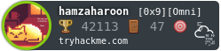

<h1 align="center">Hi 👋, It's Hamza</h1>
<h4 align="center">A Cyber Security Researcher & Developer who loves to break, code, and play CTFs.</h4>
  <h3>Certifications</h3>
  

    
    
    
<h3>HackTheBox</h3>
    

<h3>TryHackMe</h3>
    

  <h2>🐍 My Contributions 🐍</h2>
   
  
  
     

<h2 align="center">⚡ Stats ⚡</h2>
 

  
  
   
  

