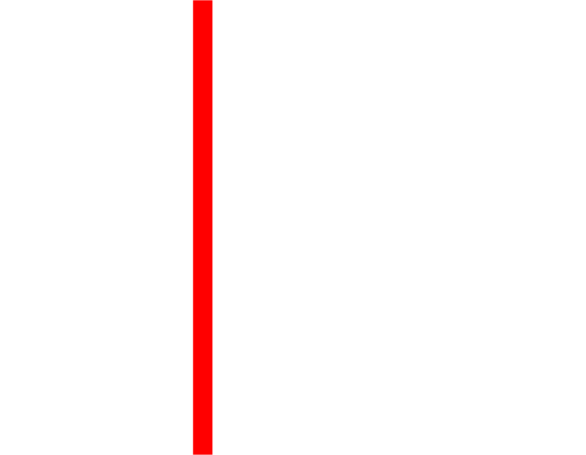

<h2 align="center"> 👋 Hi, I'm <b>Hamza</b> </h2>
<p align="center">
  
  
  
  
  
</p>


<p align="center">
  Passionate about breaking, coding, and securing systems. I explore vulnerabilities and enhance security while having fun with CTFs.
</p>

<div align="center" style="display: flex; justify-content: center; align-items: center; gap: 15px;">
  
  
  
</div>


## 🌍 **Connect with Me**
<ul>
  <li><b>🌍 Website:</b> <a href="https://thegriffyn.me" target="_blank">thegriffyn.me</a></li>
  <li><b>📜 Blog:</b> <a href="https://thegriffyn.me/blog" target="_blank">https://thegriffyn.me/blog</a></li>
  <li><b>👨🏻‍💻 HackTheBox:</b> <a href="https://app.hackthebox.com/profile/1336751" target="_blank">TheGriffyn</a></li>
  <li><b>🚀 Discord:</b> thegr1ffyn</li>
  <li><b>📩 Email:</b> <a href="mailto:hamzaharooon@protonmail.com">hamzaharooon@protonmail.com</a></li>
  <li><b>💬 Twitter:</b> <a href="https://twitter.com/thegr1ffyn" target="_blank">@thegr1ffyn</a></li>
  <li><b>📈 LinkedIn:</b> <a href="https://linkedin.com/in/hamzaharooon" target="_blank">https://linkedin.com/in/hamzaharooon</a></li>
</ul>

```javascript
(() => {
  console.log("Cybersecurity is a journey of constant learning and breaking!");
})();
```

<h2 align="center"> 📈 Quick Stats </h2> 
<p align="center">

</p>
